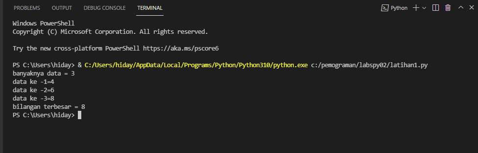

# Labspy02
soal

JAWAB
untuk menjawab soal terseut saya membuat inputan data sebagai berikut :

    a = int(input("Masukkan bilangan 1: "))
    b = int(input("Masukkan bilangan 2: "))
    c = int(input("Masukkan bilangan 3: "))

kemudian masukan angka yang di inginkan
saya masukan bilangan 1 = 4 bilangan 2 = 6 bilangan 3 = 8
lalu masukan flowchat seperti dibawah ini :

setelah itu saya menggunakan syntax dibawah ini :

    N=int(input("banyaknya data = "))
    if N>0:
        i=1
        x=int(input("data ke -"+str(i)+"="))
        max=x;total=x
        for i in range(2,N+1):
            x=int (input("data ke -"+str(i)+"="))
            total+=x
            if max<x:
                max=x

        print("bilangan terbesar =",max)

output

dari syntax diatas menggunakan output berikut :

Terima kasih

